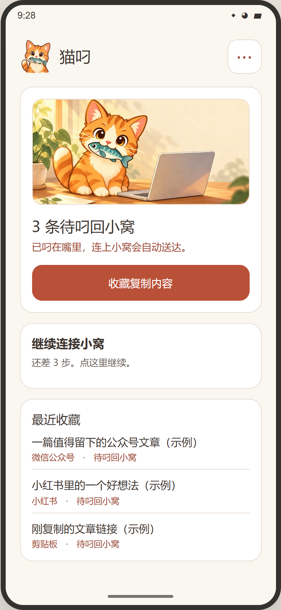
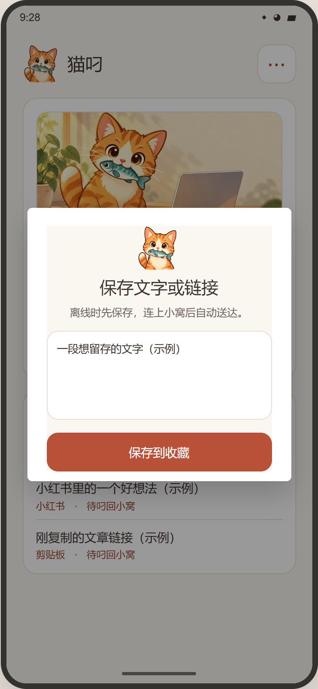
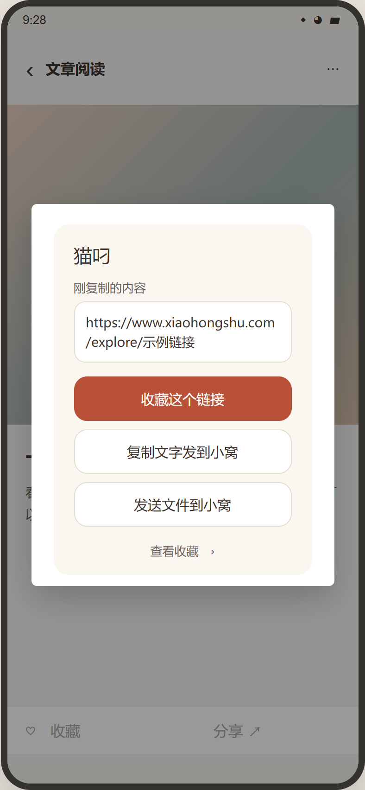

# 猫叼 / Cat Diao

安卓手机与 Windows 电脑之间的局域网小工具：收藏链接、传文字和文件，也能让 Codex 操作已配对的手机。无需 USB 线或无线调试。

A local network companion for Android and Windows. Save links, move text and files, and let Codex control a paired phone. No USB cable or wireless debugging is required.

[中文](#中文) · [English](#english)

<table>
  <tr>
    <td align="center"> 首页 / Home</td>
    <td align="center"> 收藏内容 / Save</td>
    <td align="center"> 悬浮快捷面板 / Quick actions</td>
  </tr>
</table>

界面预览根据应用界面绘制，并非手机实拍。点击图片可放大。 / These are UI previews, not photos of a running phone. Click to enlarge.

## 中文

### 下载安装

在 Windows 电脑的 Codex 中说：

> 请从 `https://github.com/ewanyuan/cat-diao` 安装 `ewan-android-phone` 技能，阅读它的 `SKILL.md`，帮我完成首次配置，并告诉我如何在手机安装猫叼。

Codex 会把仓库中的 [`ewan-android-phone/`](ewan-android-phone/) 放到当前用户的技能目录，并运行一次 `scripts/setup.ps1`。电脑需要 Python 3；首次配置会联网安装 `openpyxl`，并设置接收程序随 Windows 登录启动。个人数据保存在 `%LOCALAPPDATA%/猫叼小窝/`，不会放进技能目录。

手机安装 [猫叼 1.8 APK](ewan-android-phone/assets/cat-diao-android-1.8.apk)，打开后与电脑连接到可互访的同一 Wi-Fi。让 Codex 发起配对；手机出现请求时点“允许”，再按应用引导完成系统设置。屏幕控制、悬浮窗和修改亮度需要本人在安卓系统设置中开启。无需反复输入配对码。

### 可以做什么

- 在小红书、公众号等应用中分享链接到猫叼；离线时先保存在手机，连上电脑后送达。
- 把手机上选定的文件送到电脑，或把复制的文字送到电脑剪贴板。
- 在 Codex 中查看手机状态、打开应用、发送文件或文字、设置壁纸；手机允许屏幕控制后还能查看和点按屏幕。
- 电脑端可选接入 WeKnora。它不是手机收件的前提，需要自行配置服务地址和专用 API key。

收到的链接写入 `%LOCALAPPDATA%/猫叼小窝/收藏台账/` 下按月份分开的 Excel 台账和本地数据库；文件放在 `%LOCALAPPDATA%/猫叼小窝/手机传来的文件/`。手机显示“已到小窝”表示电脑确认收件，不表示网页全文已抓取或 AI 已处理。

### 应用场景

1. **让 AI 做手机 App 的画面调试。** Codex 等工具在电脑上改代码、构建 APK，再通过猫叼把安装包送到手机。完成安卓的安装确认后，AI 可以打开应用、截屏、点按和滑动，根据实际画面继续修改。这个循环不需要数据线，也不依赖容易断开的无线调试。当前猫叼负责传包和画面交互；系统安装确认仍需用户操作，也不提供 logcat 或断点调试。
2. **把随手收藏变成可分析的资料。** 在小红书、公众号或网页里将链接、文字分享给猫叼；暂时连不上电脑时先留在手机，回到同一局域网后送到电脑台账。之后可让 Codex 按主题整理、分析和记录反馈；配置 WeKnora 后还可继续入库。猫叼接收的是你主动分享或复制给它的内容，不会读取其他应用的整个收藏夹；AI 分析也需要另行发起。
3. **跨设备接力。** 将电脑上的提示词、草稿或文件送到手机；在手机上选好文件送回电脑，或把复制的文字放进电脑剪贴板，不用在聊天窗口里反复转发。
4. **让 AI 帮忙看手机问题。** 在手机解锁并允许屏幕控制后，Codex 可以查看状态和屏幕、打开应用、调整音量或亮度、设置壁纸，并根据截图引导下一步。

### 使用边界

手机和电脑通过局域网 HTTP 与配对令牌通信，请在信任的 Wi-Fi 上使用，避免传输敏感文件。手机锁屏或长时间熄屏时可能暂停连接；解锁后再试。猫叼不在前台时，打开其他应用可能需要点手机通知。受系统保护的页面可能无法截图。当前手机界面为中文，发布包尚未在全新电脑和其他安卓机型上验证。

安卓源码在 [`android/`](android/)；可用 Android Studio 导入。构建配置采用 Android Gradle Plugin 8.7.3、Android SDK 36 和 Java 17。仓库不含签名密钥，自行构建的 APK 通常不能直接覆盖这里提供的安装包。

## English

### Install

Ask Codex on a Windows PC:

> Install the `ewan-android-phone` skill from `https://github.com/ewanyuan/cat-diao`. Read its `SKILL.md`, complete the first-time setup, and show me how to install the Android app.

Codex should place [`ewan-android-phone/`](ewan-android-phone/) in the current user's skills directory and run `scripts/setup.ps1` once. The PC needs Python 3. Initial setup downloads `openpyxl` and starts the receiver when you sign in to Windows. Pairing details and received content stay in `%LOCALAPPDATA%/猫叼小窝/`, outside the skill folder.

Install the [Cat Diao 1.8 APK](ewan-android-phone/assets/cat-diao-android-1.8.apk) on the phone. Connect the phone and PC to the same Wi-Fi where devices can reach each other. Ask Codex to pair, approve the request on the phone, then follow the app's system-permission guide. Android requires you to enable screen control, the floating window, and brightness control yourself. Pairing does not require a recurring code.

### What it does

- Share article links from apps such as Xiaohongshu or WeChat to Cat Diao. Links wait on the phone while offline and transfer when the PC is reachable.
- Send a selected phone file to the PC, or send copied phone text to the PC clipboard.
- Ask Codex for phone status, open an app, send text or files, or set a wallpaper. With screen-control permission, Codex can also view and tap the screen.
- Optionally sync received links to WeKnora on the PC. Local receiving works without WeKnora; you must configure your own server URL and dedicated API key to enable it.

Received links are recorded in monthly Excel files and a local database under `%LOCALAPPDATA%/猫叼小窝/收藏台账/`. Received files are under `%LOCALAPPDATA%/猫叼小窝/手机传来的文件/`. “已到小窝” means the PC acknowledged receipt; it does not mean the full article was extracted or reviewed by AI.

### Use cases

1. **Visual testing for AI-built Android apps.** Codex or another AI tool can change code and build an APK on the PC, then send the package to the phone through Cat Diao. After you approve installation in Android, the AI can open the app, capture screenshots, tap and swipe, and use the visible results for another iteration. This loop needs neither a cable nor a wireless debugging connection. Cat Diao transfers the APK and supports screen interaction; it cannot silently approve installation or provide logcat and breakpoint debugging.
2. **Turn saved links into working knowledge.** Share or copy links and text from Xiaohongshu, WeChat articles, or web pages into Cat Diao. Items wait on the phone while the PC is unreachable and reach its ledger on the same local network. You can then ask Codex to group, analyze, and record feedback; WeKnora indexing is optional. Cat Diao receives items you explicitly share or copy to it. It does not read every other app's saved-items list, and AI analysis must be requested separately.
3. **Move work between devices.** Send prompts, drafts, or files from the PC to the phone. Select a phone file to send back, or place copied phone text on the PC clipboard, without forwarding everything through a chat app.
4. **Get help with a phone issue.** With the phone unlocked and screen control enabled, Codex can inspect status and screenshots, open apps, adjust volume or brightness, set a wallpaper, and suggest the next step from what it sees.

### Limits and source

Phone and PC communicate over local HTTP using a pairing token. Use a trusted Wi-Fi network and avoid sending sensitive files. A locked or sleeping phone may pause the connection. Opening another app while Cat Diao is in the background may require tapping a phone notification; some protected screens cannot be captured. The Android UI is currently in Chinese. Fresh-PC setup and other Android models have not yet been verified.

Android source is in [`android/`](android/). Import it with Android Studio; the project specifies Android Gradle Plugin 8.7.3, Android SDK 36, and Java 17. Signing keys are not included, so your own build normally cannot update the bundled APK in place.

## License / 许可

[MIT License](LICENSE). Runtime data, credentials, received files, and signing keys are not included in this repository. / 仓库不含运行数据、凭据、接收的文件或签名密钥。
